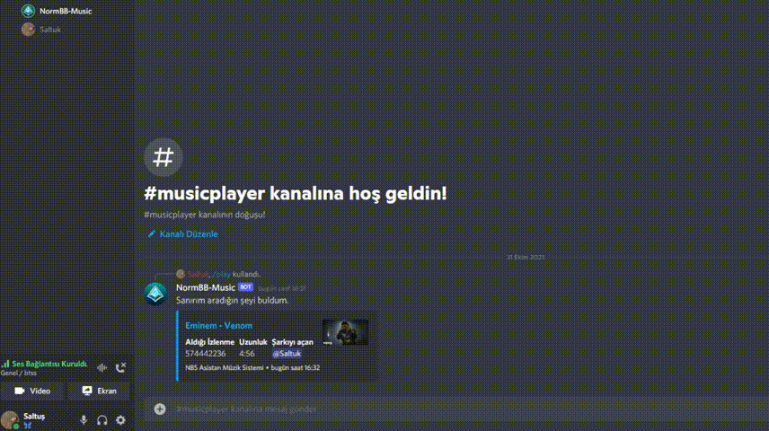

# NBS Asistan
A discord bot with button features and music player.

> ## How to use

- Create a basic Node.js app and install dependencies.
- Register your slash commands on your guild with your own client (bot) id. [`Learn more`](https://discordjs.guide/interactions/registering-slash-commands.html)
- Change token and other things on `.config.json` with yours.
- Start bot and if you see `Bot has started` message on your console. You can take a deep breath.
- Type `/play` or `/musicplayer` to start using the bot.

> ## Requirements
-  Node 16.6 or higher.
- `discord.js, @discordjs/builders, @discordjs/opus, @discordjs/rest, @discordjs/voice` for foundation of bot.
- `@koenie06/discord.js-music` for simple music commands.
- `yt-search` for youtube searching
- `nodemon` (Optional) for developing more comfortable.
- `forever` (Optional) for auto restart on crashes.`

> ## Preview
  
